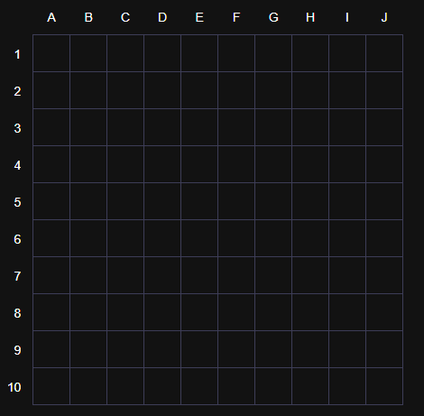
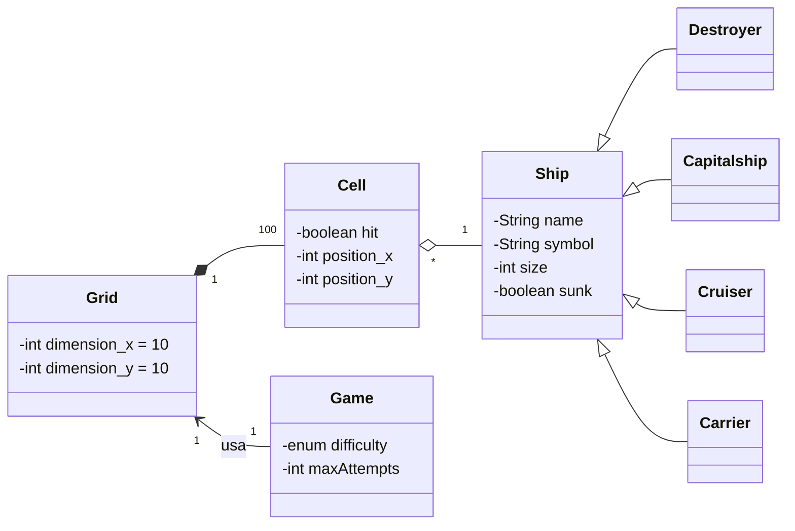
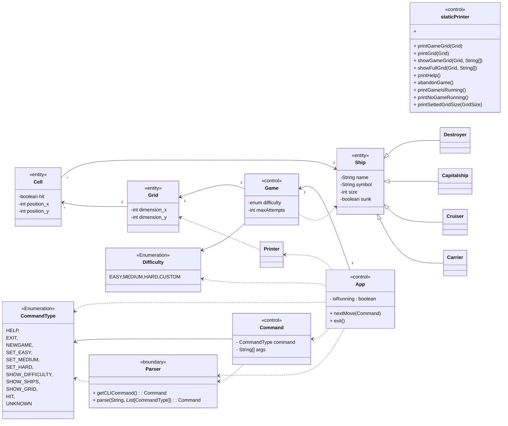
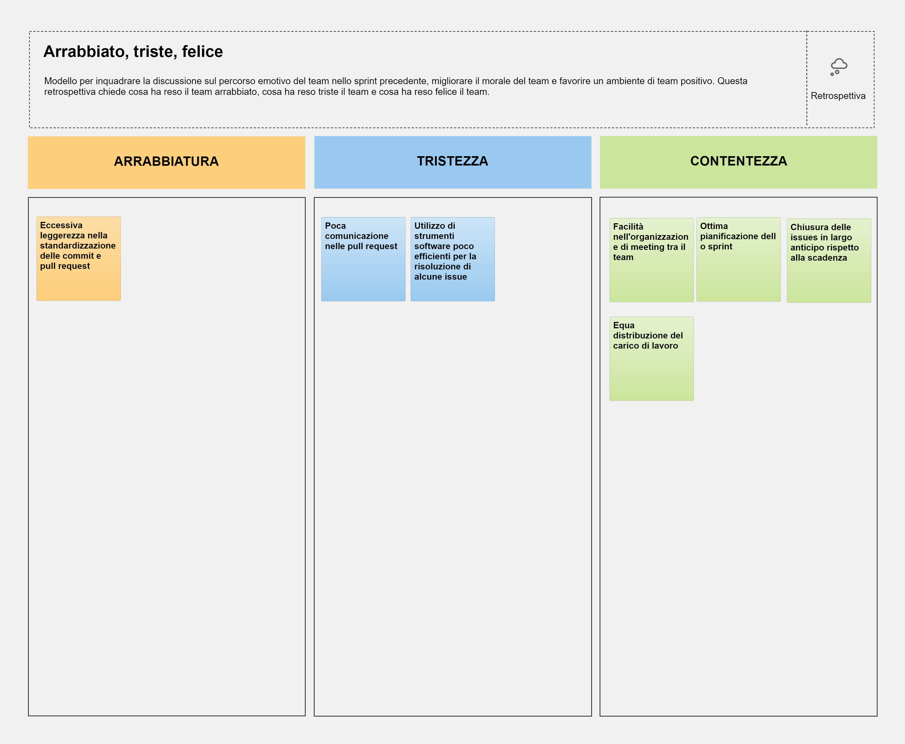

## Indice
1. [Introduzione](#1-introduzione)
2. [Modello di Dominio](#2-modello-di-dominio)
3. [Requisiti Specifici](#3-requisiti-specifici)
   - [3.1 Requisiti Funzionali](#31-requisiti-funzionali)
   - [3.2 Requisiti Non Funzionali](#32-requisiti-non-funzionali)
4. [System Design](#4-system-design)
   - [4.1 Stile architetturale adottato](#41-stile-architetturale-adottato)
   - [4.2 Diagramma dei package, diagramma dei componenti](#42-diagramma-dei-package-diagramma-dei-componenti)
   - [4.3 Commentare le decisioni prese](#43-commentare-le-decisioni-prese)
5. [OO Design](#5-oo-design)
   - [5.1 Diagrammi delle classi e diagrammi di sequenza](#51-diagrammi-delle-classi-e-diagrammi-di-sequenza)
   - [5.2 Per le user story considerate più importanti](#52-per-le-user-story-considerate-più-importanti)
   - [5.3 Menzionare l'eventuale applicazione di design pattern](#53-menzionare-leventuale-applicazione-di-design-pattern)
   - [5.4 Commentare le decisioni prese](#54-commentare-le-decisioni-prese)
6. [Riepilogo del test](#6-riepilogo-del-test)
   - [6.1 Tabella riassuntiva di coveralls (o jacoco), con dati sul numero dei casi di test e copertura del codice](#61-tabella-riassuntiva-di-coveralls-o-jacoco-con-dati-sul-numero-dei-casi-di-test-e-copertura-del-codice)
7. [Manuale utente](#7-manuale-utente)
    - [7.1 Come avviare una nuova partita](#71-come-avviare-una-nuova-partita)
    - [7.2 Come mostrare l'elenco dei comandi](#72-come-mostrare-lelenco-dei-comandi)
    - [7.3 Come impostare il livello di gioco](#73-come-impostare-il-livello-di-gioco)
    - [7.4 Come mostrare il livello di gioco](#74-come-mostrare-il-livello-di-gioco)
    - [7.5 Come mostrare i tipi di nave e la quantità](#75-come-mostrare-i-tipi-di-nave-e-la-quantità)
    - [7.6 Come svelare la griglia con le navi posizionate](#76-come-svelare-la-griglia-con-le-navi-posizionate)
    - [7.7 Come chiudere il software](#77-come-chiudere-il-software)
    - [7.8 Come impostare il numero massimo di tentativi falliti](#78-come-impostare-il-numero-massimo-di-tentativi-falliti)
    - [7.9 Come visualizzare il numero di tentativi](#79-come-visualizzare-il-numero-di-tentativi)
    - [7.10 Come abbandonare una partita](#710-come-abbandonare-una-partita)
    - [7.11 Come visualizzare il tempo di gioco](#711-come-visualizzare-il-tempo-di-gioco)
    - [7.12 Come impostare il tempo di gioco](#712-come-impostare-il-tempo-di-gioco)
8. [Processo di sviluppo e organizzazione del lavoro](#8-processo-di-sviluppo-e-organizzazione-del-lavoro)
9. [Analisi Retrospettiva](#9-analisi-retrospettiva)
   - [9.1 Sprint 0 – screenshot di una lavagna a partire dal modello Retrospettiva/"Arrabbiato, triste, felice" (Mad, Sad, Glad)](#91-sprint-0–-screenshot-di-una-lavagna-a-partire-dal-modello-retrospettivaarrabbiato-triste-felice-mad-sad-glad)

  

## 1. Introduzione 


L'obiettivo di questo progetto è quello di realizzare un'applicazione che permetta di giocare al gioco da tavolo "Battaglia Navale".

In questo file è riportata la documentazione del progetto, che comprende:
- Descrizione del gioco
- Modello di dominio
- Requisiti specifici
- System Design
- OO Design
- Riepilogo dei test
- Manuale utente
- Processo di sviluppo e organizzazione del lavoro
- Analisi Retrospettiva


All'inizio del gioco, il sistema posizionerà le proprie navi in modo segreto e randomico sulla propria griglia di gioco. 

La griglia avrà un formato del genere:



Le navi possono essere posizionate orizzontalmente o verticalmente e non possono sovrapporsi o toccarsi.

Lo scopo del gioco è affondare tutte le navi posizionate dal sistema. In ogni turno, il giocatore sceglie una casella sulla griglia in cui colpire, cercando di colpire le navi nemiche.

Se la casella colpita contiene una nave, il sistema segnerà la casella come "colpita", altrimenti verrà segnata come "mancata".


Il gioco proseguirà fino a quando il giocatore ha terminato i tentativi o tutte le navi sono state affondate.

E' possibile scegliere il livello di difficoltà del gioco, che determinerà il numero di tentativi a disposizione del giocatore.

## 2. Modello di dominio 



## 3. Requisiti Specifici
<p>In questa sezione sono presenti i requisiti funzionali e non funzionali che sono emersi durante un'analisi dei requisiti che è avvenuta confrontando il Product Owner. </p>

 
### 3.1 Requisiti Funzionali

 

 - **RF1**: Come giocatore voglio mostrare l'help con elenco comandi</br>
    **Attore**: User</br>
    **Criteri di accettazione**: Al comando **/help** o invocando l'app con flag **--help** o **-h**
     il sistema riponde con una descrizione coincisa, seguita dalla lista di comandi disponibili, uno per riga, come da esempio successivo:</br>
   •  gioca</br>
   •  esci</br>
   •  ...<br><br>
- **RF2**: Come giocatore voglio chiudere il gioco</br>
   **Attore**: User</br>
    **Criteri di accettazione**:</br>
   Al comando **/esci**
il sistema chiede conferma:</br>
•  se la conferma è positiva, l'applicazione si chiude restituendo il controllo al sistema operativo</br>
•  se la conferma è negativa, l'applicazione si predispone a ricevere nuovi tentativi o comandi</br>
<br>
- **RF3**: Come giocatore voglio impostare il livello di gioco per variare il numero massimo di tentativi sbagliati</br>
   **Attore**: User</br>
    **Criteri di accettazione**:</br>
   • Al comando **/facile** </br>
         il sistema conferma e imposta a 50 il numero massimo di tentativi falliti</br>
• Al comando **/medio** </br>
il sistema conferma  e imposta a 30 il numero massimo di tentativi falliti</br>
• Al comando **/difficile** </br>
il sistema conferma e imposta a 10 il numero massimo di tentativi falliti</br>
<br>
- **RF4**: Come giocatore voglio impostare il numero massimo di tentativi falliti per livello di gioco</br>
  **Attore**: User</br>
  **Criteri di accettazione**:</br>
  • Al comando **/facile _numero_** </br>
  il sistema conferma e imposta il numero massimo di tentativi in facile al numero indicato.</br>
  • Al comando **/medio _numero_** </br>
  il sistema conferma e imposta il numero massimo di tentativi in medio al numero indicato.</br>
  • Al comando **/difficile _numero_** </br>
  il sistema conferma e imposta il numero massimo di tentativi in difficile al numero indicato.</br>
<br>
- **RF5**: Come giocatore voglio impostare direttamente il numero massimo di tentativi che si possono fallire</br>
   **Attore**: User</br>
    **Criteri di accettazione**:<br> Al comando **/tentativi _numero_** l’applicazione rispondecon OK e imposta a _numero_ il numero massimo di tentativi a disposizione.</br><br>

- **RF6**: Come giocatore voglio impostare la taglia della griglia</br>
  **Attore**: User</br>
  **Criteri di accettazione**:<br> Al comando **/standard** l’applicazione risponde con OK e imposta a 10x10 la dimensione della griglia (è il default).<br>
  Al comando **/large** l’applicazione risponde con OK e imposta a 18x18 la dimensione della griglia. <br>Al comando **/extralarge**
  l’applicazione risponde con OK e imposta a 26x26 la dimensione della griglia.</br><br>

- **RF7**: Come giocatore voglio impostare il tempo di gioco</br>
  **Attore**: User</br>
  **Criteri di accettazione**:<br> Al comando **/tempo _numero_** l’applicazione risponde con OK e imposta a _numero_ il numero minuti a disposizione per giocare</br><br>


- **RF8**: Come giocatore voglio mostrare i tipi di nave e il numero </br>
   **Attore**: User</br>
    **Criteri di accettazione**: Al comando **/mostranavi** </br>
il sistema risponde visualizzando, per ogni tipo di nave, la dimensione in quadrati e il numero di esemplari da affondare:</br></br>
•  Cacciatorpediniere   ⊠⊠      esemplari: 4</br>
•  Incrociatore         ⊠⊠⊠     esemplari: 3 </br>
•  Corazzata            ⊠⊠⊠⊠    esemplari: 2 </br>
•  Portaerei            ⊠⊠⊠⊠⊠  esemplari: 1</br><br> 

- **RF9**: Come giocatore voglio iniziare una nuova partita </br>
   **Attore**: User</br>
    **Criteri di accettazione**:<br> Al comando **/gioca** 
se nessuna partita è in corso, il sistema imposta causalmente le navi nella griglia, in orizzontale o in verticale, mostra la griglia vuota e si predispone a ricevere il primo tentativo o altri comandi.<br><br>

- **RF10**: Come giocatore voglio svelare la griglia con le navi posizionate <br>
   **Attore**: User</br>
    **Criteri di accettazione**: Al comando **/svelagriglia** 
il sistema risponde visualizzando, una griglia 10x10, con le righe numerate da 1 a 10 e le colonne numerate da A a J, e tutte le navi posizionate<br><br> 

- **RF11**: Come giocatore voglio mostrare il tempo di gioco <br>
  **Attore**: User</br>
  **Criteri di accettazione**: Al comando **/mostratempo** l’applicazione risponde visualizzando il numero di minuti trascorsi nel gioco e il numero di minuti ancora disponibili.<br><br>

- **RF12**: Come giocatore voglio effettuare un tentativo per colpire una nave<br>
  **Attore**: User</br>
  **Criteri di accettazione**:<br> Digitando una coppia di caratteriseparati da un trattino,corrispondenti rispettivamente al numero di riga e alla lettera della colonna, (es. B-4), l’applicazione risponde:<br> • “acqua” se sulla cella non è posizionata nessuna nave; <br>
  • "colpito" se sulla cella è posizionata una nave;<br>
  • "colpito e affondato" se sulla cella è posizionata una nave ed è l’ultimacella non colpita della nave.<br> Qualunque sia l’esito del tentativo, l’applicazione mostra la grigliacon le navi colpite parzialmente o affondate, il numero di tentativi già effettuati, e il tempo trascorso.<br> La partitatermina con successo se il tentativo ha affondato l’ultima nave.<br> La partita termina con insuccesso se è stato raggiunto il numero massimo di tentativi falliti o seè scaduto il tempo di gioco.<br><br>

- **RF13**: Come giocatore voglio mostrare la griglia con le navi colpite e affondate<br>
  **Attore**: User</br>
  **Criteri di accettazione**:<br> Al comando **/mostragriglia** l’applicazione risponde visualizzando, una grigliacon le righe numerate a partire da 1 e le colonne numerate a partire da A, conle navi affondate e le sole parti già colpite delle navi non affondate.<br><br>

- **RF14**: Come giocatore voglio mostrare il numero di tentativi già effettuati e il numero di tentativi falliti.<br>
  **Attore**: User</br>
  **Criteri di accettazione**:<br> Al comando **/mostratentativi** l’applicazione risponde visualizzando il numero di tentativi già effettuati, il numero di tentativi fallitie il numero massimo di tentativi falliti.<br><br>

- **RF15**: Come giocatore voglio abbandonareuna partita. <br>
  **Attore**: User</br>
  **Criteri di accettazione**:<br> Al comando **/abbandona** l'applicazione chiede conferma:<br> 
  • se la conferma è positiva, l’applicazione risponde visualizzandosulla grigliala posizione di tutte le navi e si predispone a ricevere nuovi comandi<br>
  • se la conferma è negativa, l'applicazione si predispone a ricevere nuovi tentativi o comandi

### 3.2 Requisiti Non Funzionali

- **RNF1**: il container docker dell’app deve essere eseguito da terminali che supportano Unicode con encoding UTF-8 o UTF-16.
Elenco di terminali supportati:</br>
   - Linux: </br>
      • terminal</br>
   - Windows: </br>
      • Powershell</br>
      • Git Bash (in questo caso il comando Docker ha come prefisso winpty; es: winpty docker -it ....)</br></br>

   Comando per l’esecuzione del container: </br>
   Dopo aver eseguito il comando docker pull copiandolo da GitHub Packages, Il comando Docker da usare per eseguire il container contenente l’applicazione è:</br>
   ```bash
   $ docker run --rm -it ghcr.io/softeng2223-inf-uniba/battleship-base2223:latest
   ```
   dove base2223 sarà sostitituito con il nome del gruppo.


## 4. System Design

  ### 4.1 Stile architetturale adottato (opzionale)

  ### 4.2 Diagramma dei package, diagramma dei componenti (opzionali) 

  ### 4.3 Commentare le decisioni prese (opzionale)

## 5. OO Design  

  ### 5.1 Diagrammi delle classi e diagrammi di sequenza 



  ### 5.2 Per le user story considerate più importanti 
**NewGame**

**SetAttempts**

**SetDifficulty**

**setGridSize**

**Hit**


  ### 5.3 Applicazione Design Pattern
Per poter disaccopiare il più possibile la componente di input con la logica di gioco e con la logica responsabile di chiamare le
diverse componenti, è stato utilizzato il design pattern **Facade**.
Nello specifico una variante di questo design pattern, il **Remote Facade**.
Non è un puro Remote Facade semplicemente perchè questo pattern è altamente utilizzato per interfacce remote, mentre in questo caso avviene tutto sullo stesso sistema.
Il punto è quello di utilizzare un DTO per comunicare più informazioni possibili alla facciata, che in questo caso è la classe **App** che richiamrerà le varie componenti del sistema.
In questo modo si disaccoppia la logica di gioco dalla logica di input e dalla logica di chiamata delle componenti.</br></br>
Il DTO è la classe **Command** che contiene il comando da eseguire e i parametri necessari per eseguirlo.</br>
La classe **Parser** si occupa di creare il DTO a partire dalla stringa inserita dall'utente.</br>
La classe **App** si occupa di chiamare le varie componenti del sistema a seconda del comando ricevuto.</br></br>
Se in futuro volessimo introdurre un modo diverso per comunicare con il sistema, basterà creare un nuovo parser che crei un DTO a partire da un input diverso.
Se volessimo scalare ulteriormnte il sistema rendendolo Client/Server, cambierà solo il modo in cui App riceve il DTO.
La logica di gioco e la logica relativa alle chiamate delle diverse componenti non subiranno nessuna variazione.
Per maggiori informazioni: https://martinfowler.com/eaaCatalog/dataTransferObject.html


  ### 5.4 Commentare le decisioni prese (opzionale)

## 6. Riepilogo del test 

   ### 6.1 Riportare la tabella riassuntiva di coveralls (o jacoco), con dati sul numero dei casi di test e copertura del codice

## 7. Manuale utente


## 7. Manuale utente

### 7.1 Come avviare una nuova partita

Per avviare una nuova partita è necessario digitare il comando `/gioca`. Se nessuna partita è in corso, il sistema imposta casualmente le navi nella griglia, in orizzontale o in verticale, mostra la griglia vuota e si predispone a ricevere il primo tentativo o altri comandi.


### 7.2 Come mostrare l'elenco dei comandi

Per mostrare l'elenco dei comandi è necessario digitare il comando `/help`. Verrà mostrato l'elenco dei comandi disponibili.


### 7.3 Come impostare il livello di gioco

Per impostare il livello di gioco è necessario digitare il comando `/facile`, `/medio` o `/difficile`. A seconda del comando digitato, il sistema conferma e imposta a 50, 30 o 10 il numero massimo di tentativi falliti.


### 7.4 Come mostrare il livello di gioco

Per mostrare il livello di gioco è necessario digitare il comando `/mostralivello`. Verrà mostrato il livello di gioco e il numero di massimo di tentativi falliti.


### 7.5 Come mostrare i tipi di nave e la quantità

Per mostrare i tipi di nave e la quantità è necessario digitare il comando `/mostranavi`. Verrà mostrato, per ogni tipo di nave, la dimensione in quadrati e il numero di esemplari da affondare.


### 7.6 Come svelare la griglia con le navi posizionate

Per svelare la griglia con le navi posizionate è necessario digitare il comando `/svelagriglia`. Verrà mostrata una griglia 10x10, con le righe numerate da 1 a 10 e le colonne numerate da A a J, e tutte le navi posizionate.


### 7.7 Come chiudere il software

Per chiudere il software è necessario digitare il comando `/esci`. Verrà mostrato un messaggio di conferma e il software verrà chiuso.


### 7.8 Come impostare il numero massimo di tentativi falliti

Per impostare il numero massimo di tentativi falliti è necessario digitare il comando `/tentativi` seguito da un numero. Ad esempio, `/tentativi 10` imposta il numero massimo di tentativi falliti a 10. L'applicazione risponderà con "OK".


### 7.9 Come visualizzare il numero di tentativi

Per visualizzare il numero di tentativi è necessario digitare il comando `/mostratentativi`. L'applicazione risponderà visualizzando il numero di tentativi già effettuati, il numero di tentativi falliti e il numero massimo di tentativi falliti.


### 7.10 Come abbandonare una partita

Per abbandonare una partita è necessario digitare il comando `/abbandona`. L'applicazione chiederà conferma e, se la conferma è positiva, mostrerà sulla griglia la posizione di tutte le navi e si predispone a ricevere nuovi comandi. Se la conferma è negativa, l'applicazione si predispone a ricevere nuovi tentativi o comandi.


### 7.11 Come visualizzare il tempo di gioco

Per visualizzare il tempo di gioco, è necessario digitare il comando `/mostratempo`. L'applicazione risponderà visualizzando il numero di minuti trascorsi nel gioco e il numero di minuti ancora disponibili.


### 7.12 Come impostare il tempo di gioco

Per impostare il tempo di gioco, è necessario digitare il comando `/timer` seguito da un numero che rappresenta la quantità di tempo espressa in minuti. Ad esempio, `/timer 30` imposta il tempo di gioco a 30 minuti. L'applicazione risponderà con "OK" e imposterà il numero di minuti a disposizione per giocare.


## 8. Processo di sviluppo e organizzazione del lavoro

Durante lo sviluppo del progetto è stato utilizzato il sistema di versionamento Git, con repository remoto su GitHub.<br>
Il lavoro è stato organizzato in 3 sprint, con durata di 2 settimane ciascuno.
Come IDE di riferimento è stato utilizzato IntelliJ IDEA.<br>
Sono stati utilizzate delle procedure standardizzate per il completamento dei task.<br>

"**Una volta che mi è stata assegnata una issue, che devo fare?**"<br>
Quando viene assegnata una issue, il primo passo è quello di creare un branch che ha come nome la seguente struttura:<br>
`<iniziali nome e cognome>-<numero issue>-<descrizione>`
Ad esempio:
_dr-55-crezione-classe-ship_

Si ricorda che il comando per creare un branch è `git checkout -b <nome branch>`.<br>
É importante creare il branch dall'ultima versione del main.<br>

"**Ho effettuato le modifiche, come faccio a caricarle su GitHub?**"<br>
Una volta apportate le modifiche al codice, si verifica che Checkstyle e SpotBug non segnalino errori.<br>
Nel caso in cui ci dovessero essere errori che richiedono una variazione "pesante" del codice, è bene informare il team.<br>

Si puo effettuare una commit con la seguente struttura: `[ fix | (refactor | ref) | feat | doc ]: <descrizione>`.<br>
Ad esempio: `feat: aggiunta metodo getShip in Ship`.<br>

Una volta effettuata la commit, si effettua una push del branch su GitHub.<br>
Il comando per effettuare una push è `git push origin <nome branch>`.<br>

"**Ho effettuato una push su GitHub, come faccio a creare una pull request?**"<br>
Una volta effettuata la push, si accede alla pagina del repository su GitHub.<br>
Si seleziona il branch appena creato e si clicca su "Compare & pull request".<br>
Si inserisce una descrizione della pull request e si assegnano dei reviewers e la milestone.<br>
L'autore della feature non può essere un reviewer.<br>
Una volta assegnati i reviewers, si clicca su "Create pull request".<br>
Nel caso in cui la pull request chiuda un'issue, si inserisce `Close: #<numero issue>`.<br>
Nel caso in cui la pull request contribuisca in parte alla risoluzione di un'issue, si inserisce `Relates to: #<numero issue>`.<br>

"**La pull request mi segnala dei conflitti, come posso risolverli?**"<br>
Il modo migliore è quello di effettuare un rebase del branch rispetto al main.<br>
In locale, si effettua una pull dell'ultima versione del main e si esegue il comando `git rebase main` sul branch.<br>
Successivamente, in IntelliJ, nella sezione del Verison Control, si clicca su _Resolve_ e si risolvono i conflitti.<br>
Uscirà una schermata divisa in tre parti: a sinistra il branch, al centro il risultato e a destra il main.<br>
Una volta risolti i conflitti, si effettua una `git rebase --continue` e si effettua una push forzata sul remote.
Il comando per effettuare una push forzata è `git push -f origin <nome branch>`.<br>


## 9. Analisi retrospettiva 

### 9.1 Sprint 0 – screenshot di una lavagna a partire dal modello Retrospettiva/"Arrabbiato, triste, felice" (Mad, Sad, Glad)



### 9.2 Sprint 1 – screenshot di una lavagna a partire dal modello Retrospettiva/"Arrabbiato, triste, felice" (Mad, Sad, Glad)

